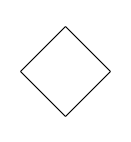
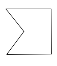
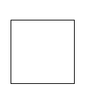
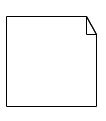

# Uml Diagram Shapes

## Uml Class Diagram Shapes

Class diagram is used to represent the static view of an application. The class diagrams are widely used in the modelling of object oriented systems because they are the only UML diagrams which can be mapped directly with object-oriented languages.
Diagram supports to generate the class diagram shapes from business logic.

The UML class diagram shapes are explained as follows.

## Class

* A class describes a set of objects that shares the same specifications of features, constraints, and semantics. To define a class object, you should define the classifier as [`class`](../api/diagram/umlClassifierShapeModel#class).

* Also, define the [`name`](../api/diagram/umlClassModel#name), [`attributes`](../api/diagram/umlClassModel#attributes), and [`methods`](../api/diagram/umlClassModel#methods) of the class using the class property of node.

* The attribute’s [`name`](../api/diagram/umlClassAttributeModel#name), [`type`](../api/diagram/umlClassAttributeModel#type), and [`scope`](../api/diagram/umlClassAttributeModel#scope) properties allow you to define the name, data type, and visibility of the attribute.

* The method’s [`name`](../api/diagram/umlClassMethodModel#name), [`parameters`](../api/diagram/umlClassMethodModel#parameters), [`type`](../api/diagram/umlClassMethodModel#type), and [`scope`](../api/diagram/umlClassMethodModel#scope) properties allow you to define the name, parameter, return type, and visibility of the methods.

* The method parameters object properties allow you to define the name and type of the parameter.

* The following code example illustrates how to create a class.



```typescript
import * as React from "react";
import * as ReactDOM from "react-dom";
import {
    Diagram,
    DiagramComponent,
    NodeModel,
    UmlClassifierShapeModel
} from "@syncfusion/ej2-react-diagrams";
let diagramInstance: DiagramComponent;

// A node is created and stored in nodes array.
let node: NodeModel[] = [{
    id: "Patient",
    //Position of the node
    offsetX: 200,
    offsetY: 200,
    shape: {
      type: "UmlClassifier",
      //Define class object
      class: {
        name: "Patient",
        //Define class attributes
        attributes: [{ name: "accepted", type: "Date" }],
        //Define class methods
        methods: [{ name: "getHistory", type: "getHistory" }]
      },
      classifier: "Class"
    } as UmlClassifierShapeModel
}];

// initialize Diagram component

ReactDOM.render( <DiagramComponent id = "diagram"
        width = {
            '100%'
        }
        height = {
            '600px'
        }
        // Add node
        nodes = {
            node
        }
        // render initialized Diagram
        />,   document.getElementById("diagram") );
```



## Interface

* An Interface is a kind of classifier that represents a declaration of a set of coherent public features and obligations. To create an interface, define the classifier property as [`interface`](../api/diagram/umlClassifierShapeModel#interface).

* Also, define the [`name`](../api/diagram/umlInterfaceModel#name), [`attributes`](../api/diagram/umlInterfaceModel#attributes), and [`methods`](../api/diagram/umlInterfaceModel#methods) of the interface using the interface property of the node.

* The attribute’s name, type, and scope properties allow you to define the name, data type, and visibility of the attribute.

* The method’s name, parameter, type, and scope properties allow you to define the name, parameter, return type, and visibility of the methods.

* The method parameter object properties of name and type allows you to define the name and type of the parameter.

* The following code example illustrates how to create an interface.



```typescript
import * as React from "react";
import * as ReactDOM from "react-dom";
import {
    Diagram,
    DiagramComponent,
    NodeModel,
    UmlClassifierShapeModel
} from "@syncfusion/ej2-react-diagrams";
let diagramInstance: DiagramComponent;

// A node is created and stored in nodes array.
let node: NodeModel[] = [{
    id: "Patient",
    //Position of the node
    offsetX: 200,
    offsetY: 200,
    shape: {
      type: "UmlClassifier",
      //Define interface object
      interface: {
        name: "Patient",
        //Define interface attributes
        attributes: [{ name: "owner", type: "String[*]" }],
        //Define interface methods
        methods: [
          {
            name: "deposit",
            parameters: [
              {
                name: "amount",
                type: "Dollars"
              }
            ]
          }
        ]
      },
      classifier: "Interface"
     } as UmlClassifierShapeModel
}];

// initialize Diagram component

ReactDOM.render( <DiagramComponent id = "diagram"
        width = {
            '100%'
        }
        height = {
            '600px'
        }
        // Add node
        nodes = {
            node
        }
        // render initialized Diagram
        />,   document.getElementById("diagram") );
```



## Enumeration

* To define an enumeration, define the classifier property of node as [`enumeration`](../api/diagram/umlClassifierShapeModel#enumeration). Also, define the name and members of the enumeration using the enumeration property of the node.

* You can set a name for the enumeration members collection using the name property of members collection.

* The following code example illustrates how to create an enumeration.



```typescript
import * as React from "react";
import * as ReactDOM from "react-dom";
import {
    Diagram,
    DiagramComponent,
    NodeModel,
    UmlClassifierShapeModel
} from "@syncfusion/ej2-react-diagrams";
let diagramInstance: DiagramComponent;

// A node is created and stored in nodes array.
let node: NodeModel[] = [{
    id: "Patient",
    offsetX: 200,
    offsetY: 200,
    shape: {
      type: "UmlClassifier",
      //Define enumeration object
      enumeration: {
        name: "AccountType",
        //set the members of enumeration
        members: [
          {
            name: "Checking Account",
          },
          {
            name: "Savings Account"
          },
          {
            name: "Credit Account"
          }
        ]
      },
      classifier: "Enumeration"
    } as UmlClassifierShapeModel
}];

// initialize Diagram component

ReactDOM.render( <DiagramComponent id = "diagram"
        width = {
            '100%'
        }
        height = {
            '600px'
        }
        // Add node
        nodes = {
            node
        }
        // render initialized Diagram
        />,   document.getElementById("diagram") );
```



## Connector shapes

* The connector shape property defines the role or meaning of the connector.

* The different types of connector shapes are BPMN, UmlClassifier, and UmlActivity and can render these shapes by setting the connector shape type property.

* The type of flow shapes in a BPMN process are sequence, association, and message.

## Relationships

* A relationship is a general term covering the specific types of logical connections found on class diagrams.

* The list of relationships are demonstrated as follows.

| Shape       | Image                                |
| ----------- | ------------------------------------ |
| Association |  |
| Aggregation |   |
| Composition |  |
| Inheritance |    |
| Dependency  |  |

## Association

Association is basically a set of links that connects elements of an UML model. The type of association are as follows.

    1. Directional
    2. BiDirectional

The association property allows you to define the type of association. The default value of association is “Directional”. The following code example illustrates how to create an association.



```typescript
import * as React from "react";
import * as ReactDOM from "react-dom";
import {
    Diagram,
    DiagramComponent,
    ConnectorModel
} from "@syncfusion/ej2-react-diagrams";
let diagramInstance: DiagramComponent;

// A node is created and stored in nodes array.
let connector: ConnectorModel[] = [{
    id: "connector",
    //Define connector start and end points
    sourcePoint: { x: 100, y: 100 },
    targetPoint: { x: 300, y: 300 },
    type: "Straight",
    shape: {
      type: "UmlClassifier",
      relationship: "Association",
      //Define type of association
      association: "BiDirectional"
    }
}];

// initialize Diagram component

ReactDOM.render( <DiagramComponent id = "diagram"
        width = {
            '100%'
        }
        height = {
            '600px'
        }
        // Add node
        connectors = {
            connector
        }
        // render initialized Diagram
        />,   document.getElementById("diagram") );
```



## Aggregation

Aggregation is a binary association between a property and one or more composite objects which group together a set of instances.
Aggregation is decorated with a hollow diamond. To create an aggregation shape, define the relationship as “aggregation”.

The following code example illustrates how to create an aggregation.



```typescript
import * as React from "react";
import * as ReactDOM from "react-dom";
import {
    Diagram,
    DiagramComponent,
    ConnectorModel
} from "@syncfusion/ej2-react-diagrams";
let diagramInstance: DiagramComponent;

// A node is created and stored in nodes array.
let connector: ConnectorModel[] = [{
    id: "connector",
    //Define connector start and end points
    sourcePoint: { x: 100, y: 100 },
    targetPoint: { x: 300, y: 300 },
    type: "Straight",
    shape: {
      type: "UmlClassifier",
      //Set an relationship for connector
      relationship: "Aggregation"
    }
}];

// initialize Diagram component

ReactDOM.render( <DiagramComponent id = "diagram"
        width = {
            '100%'
        }
        height = {
            '600px'
        }
        // Add node
        connectors = {
            connector
        }
        // render initialized Diagram
        />,   document.getElementById("diagram") );
```



## Composition

Composition is a “strong” form of “aggregation”. Composition is decorated with a black diamond. To create a composition shape, define the relationship property of connector as “composition”.

The following code example illustrates how to create a composition.



```typescript
import * as React from "react";
import * as ReactDOM from "react-dom";
import {
    Diagram,
    DiagramComponent,
    ConnectorModel
} from "@syncfusion/ej2-react-diagrams";
let diagramInstance: DiagramComponent;

// A node is created and stored in nodes array.
let connector: ConnectorModel[] = [{
    id: "connector",
    //Define connector start and end points
    sourcePoint: { x: 100, y: 100 },
    targetPoint: { x: 300, y: 300 },
    type: "Straight",
    shape: {
      type: "UmlClassifier",
      //Set an relationship for connector
      relationship: "Composition"
    }
}];

// initialize Diagram component

ReactDOM.render( <DiagramComponent id = "diagram"
        width = {
            '100%'
        }
        height = {
            '600px'
        }
        // Add node
        connectors = {
            connector
        }
        // render initialized Diagram
        />,   document.getElementById("diagram") );
```



## Dependency

Dependency is a directed relationship, which is used to show that some UML elements needs or depends on other model elements for specifications. Dependency is shown as dashed line with opened arrow.
To create a dependency, define the relationship property of connector as “dependency”.

The following code example illustrates how to create an dependency.



```typescript
import * as React from "react";
import * as ReactDOM from "react-dom";
import {
    Diagram,
    DiagramComponent,
    ConnectorModel
} from "@syncfusion/ej2-react-diagrams";
let diagramInstance: DiagramComponent;

// A node is created and stored in nodes array.
let connector: ConnectorModel[] = [{
    id: "connector",
    //Define connector start and end points
    sourcePoint: { x: 100, y: 100 },
    targetPoint: { x: 300, y: 300 },
    type: "Straight",
    shape: {
      type: "UmlClassifier",
      //Set an relationship for connector
      relationship: "Dependency"
    }
}];

// initialize Diagram component

ReactDOM.render( <DiagramComponent id = "diagram"
        width = {
            '100%'
        }
        height = {
            '600px'
        }
        // Add node
        connectors = {
            connector
        }
        // render initialized Diagram
        />,   document.getElementById("diagram") );
```



## Inheritance

Inheritance is also called as “generalization”. Inheritance is a binary taxonomic directed relationship between a more general classifier (super class) and a more specific classifier (subclass).
Inheritance is shown as a line with hollow triangle.

To create an inheritance, define the relationship as “inheritance”.

The following code example illustrates how to create an inheritance.



```typescript
import * as React from "react";
import * as ReactDOM from "react-dom";
import {
    Diagram,
    DiagramComponent,
    ConnectorModel
} from "@syncfusion/ej2-react-diagrams";
let diagramInstance: DiagramComponent;

// A node is created and stored in nodes array.
let connector: ConnectorModel[] = [{
    id: "connector",
    //Define connector start and end points
    sourcePoint: { x: 100, y: 100 },
    targetPoint: { x: 300, y: 300 },
    type: "Straight",
    shape: {
      type: "UmlClassifier",
      //Set an relationship for connector
      relationship: "Inheritance"
    }
}];

// initialize Diagram component

ReactDOM.render( <DiagramComponent id = "diagram"
        width = {
            '100%'
        }
        height = {
            '600px'
        }
        // Add node
        connectors = {
            connector
        }
        // render initialized Diagram
        />,   document.getElementById("diagram") );
```



## Multiplicity

Multiplicity is a definition of an inclusive interval of non-negative integers to specify the allowable number of instances of described element. The type of multiplicity are as follows.

    1. OneToOne
    2. ManyToOne
    3. OneToMany
    4. ManyToMany

* By default the multiplicity will be considered as “OneToOne”.

* The multiplicity property in UML allows you to specify large number of elements or some collection of elements.

* The shape multiplicity’s source property is used to set the source label to connector and the target property is used to set the target label to connector.

* To set an optionality or cardinality for the connector source label, use optional property.

* The [`lowerBounds`](../api/diagram/multiplicityLabelModel#lowerBounds) and [`upperBounds`](../api/diagram/multiplicityLabelModel#upperBounds) could be natural constants or constant expressions evaluated to natural (non negative) number. Upper bound could be also specified as asterisk ‘\*’ which denotes unlimited number of elements. Upper bound should be greater than or equal to the lower bound.

* The following code example illustrates how to customize the multiplicity.



```typescript
import * as React from "react";
import * as ReactDOM from "react-dom";
import {
    Diagram,
    DiagramComponent,
    ConnectorModel
} from "@syncfusion/ej2-react-diagrams";
let diagramInstance: DiagramComponent;

// A node is created and stored in nodes array.
let connector: ConnectorModel[] = [{
    id: "connector",
    //Define connector start and end points
    sourcePoint: { x: 100, y: 100 },
    targetPoint: { x: 300, y: 300 },
    type: "Straight",
    shape: {
      type: "UmlClassifier",
      relationship: "Dependency",
      multiplicity: {
        //Set multiplicity type
        type: "OneToMany",
        //Set source label to connector
        source: {
          optional: true,
          lowerBounds: 89,
          upperBounds: 67
        },
        //Set target label to connector
        target: {
          optional: true,
          lowerBounds: 78,
          upperBounds: 90
        }
      }
    }
}];

// initialize Diagram component

ReactDOM.render( <DiagramComponent id = "diagram"
        width = {
            '100%'
        }
        height = {
            '600px'
        }
        // Add node
        connectors = {
            connector
        }
        // render initialized Diagram
        />,   document.getElementById("diagram") );
```



## UmlActivity diagram

Activity diagram is basically a flowchart to represent the flow from one activity to another. The activity can be described as an operation of the system.

The purpose of an activity diagram can be described as follows.

    1. Draw the activity flow of a system.

    2. Describe the sequence from one activity to another.

    3. Describe the parallel, branched, and concurrent flow of the system.

To create a UmlActivity, define type as "UmlActivity" and the list of built-in shapes as demonstrated as follows and it should be set in the "shape" property.

| Shape          | Image                                    |
| -------------- | ---------------------------------------- |
| Action         |           |
| Decision       |          |
| MergeNode      |        |
| InitialNode    |        |
| FinalNode      |       |
| ForkNode       |        |
| JoinNode       |        |
| TimeEvent      |       |
| AcceptingEvent |  |
| SendSignal     |      |
| ReceiveSignal  |   |
| StructuredNode |  |
| Note           |            |

The following code illustrates how to create a UmlActivity shapes.



```typescript
import * as React from "react";
import * as ReactDOM from "react-dom";
import {
    Diagram,
    DiagramComponent,
    NodeModel
} from "@syncfusion/ej2-react-diagrams";
let diagramInstance: DiagramComponent;

// A node is created and stored in nodes array.
let node: NodeModel[] = [{
    id: "UmlDiagram",
    //Set node size
    width: 100,
    height: 100,
    //position the node
    offsetX: 200,
    offsetY: 200,
    shape: {
      type: "UmlActivity",
      //Define UmlActivity shape
      shape: "Action"
    }
}];

// initialize Diagram component

ReactDOM.render( <DiagramComponent id = "diagram"
        width = {
            '100%'
        }
        height = {
            '600px'
        }
        // Add node
        nodes = {
            node
        }
        // render initialized Diagram
        />,   document.getElementById("diagram") );
```



### UmlActivity connector

To create an UmlActivity connector, define the type as "UmlActivity" and flow as either "Exception" or "Control" or "Object".

The following code illustrates how to create a UmlActivity connector.



```typescript
import * as React from "react";
import * as ReactDOM from "react-dom";
import {
    Diagram,
    DiagramComponent,
    ConnectorModel
} from "@syncfusion/ej2-react-diagrams";
let diagramInstance: DiagramComponent;

// A node is created and stored in nodes array.
let connector: ConnectorModel[] = [{
     id: 'connector',
     type: 'Straight',
     //Define connector start and end points
     sourcePoint: { x: 100, y: 100 },
     targetPoint: { x: 200, y: 200 },
     shape: { type: 'UmlActivity', flow: 'Exception' }
}];

// initialize Diagram component

ReactDOM.render( <DiagramComponent id = "diagram"
        width = {
            '100%'
        }
        height = {
            '600px'
        }
        // Add node
        connectors = {
            connector
        }
        // render initialized Diagram
        />,   document.getElementById("diagram") );
```



### Editing

You can edit the name, attributes, and methods of the class diagram shapes just double clicking, similar to editing a node annotation.

The following image illustrates how the text editor looks in an edit mode.

