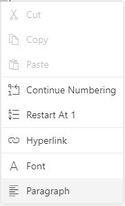

# Working with Lists

Document Editor supports both the single-level and multilevel lists. Lists are used to organize data as step-by-step instructions in documents for easy understanding of key points. You can apply list to the paragraph either using supported APIs.

## Create bullet list

Bullets are usually used for unordered lists. To apply bulleted list for selected paragraphs, use the following method of ‘Editor’ instance.

> applyBullet(bullet, fontFamily);

|Parameter|Type|Description|
|---------|----|-----------|
|Bullet|string|Bullet character.|
|fontFamily|string|Bullet font family.|

Refer to the following sample code.

```typescript
documenteditor.editor.applyBullet('\uf0b7', 'Symbol');
```

## Create numbered list

Numbered lists are usually used for ordered lists. To apply numbered list for selected paragraphs, use the following method of ‘Editor’ instance.

> applyNumbering(numberFormat,listLevelPattern)

|Parameter|Type|Description|
|---------|----|-----------|
|numberFormat|string|“%n” representations in ‘numberFormat’ parameter will be replaced by respective list level’s value.“%1)” will be displayed as “1)”|
|listLevelPattern(optional)|string|Default value is 'Arabic'.|

Refer to the following example.

```typescript
documenteditor.editor.applyNumbering('%1)', 'UpRoman');
```

## Clear list

You can also clear the list formatting applied for selected paragraphs. Refer to the following sample code.

```typescript
documenteditor.editor.clearList();
```

## Working with lists

The following sample demonstrates how to create bullet and numbering lists in document editor.



```typescript
import * as ReactDOM from 'react-dom';
import * as React from 'react';
import { DocumentEditorComponent, Selection, Editor, EditorHistory, ContextMenu, TableDialog } from '@syncfusion/ej2-react-documenteditor';
import { ToolbarComponent, ItemDirective, ItemsDirective, } from '@syncfusion/ej2-react-navigations';

DocumentEditorComponent.Inject(Selection, Editor, EditorHistory, ContextMenu, TableDialog);
export class Default extends React.Component<{}, {}> {
    public documenteditor: DocumentEditorComponent;

    toolbarButtonClick(args): void {
        switch (args.item.id) {
            case 'Bullets':
                //To create bullet list
                this.documenteditor.editor.applyBullet('\uf0b7', 'Symbol');
                break;
            case 'Numbering':
                //To create numbering list
                this.documenteditor.editor.applyNumbering('%1)', 'UpRoman');
                break;
            case 'clearlist':
                //To clear list
                this.documenteditor.editor.clearList();
                break;
        }
    }

    render() {
        return (
            <div>
                <ToolbarComponent id="toolbar" clicked={this.toolbarButtonClick.bind(this)} >
                    <ItemsDirective>
                        <ItemDirective id="Bullets" prefixIcon="e-de-ctnr-bullets e-icons" tooltipText="Bullets" />
                        <ItemDirective id="Numbering" prefixIcon="e-de-ctnr-numbering e-icons" tooltipText="Numbering" />
                        <ItemDirective id="clearlist" text="Clear" tooltipText="Clear List" />
                    </ItemsDirective>
                </ToolbarComponent>
                <DocumentEditorComponent id="container" height={'330px'} ref={scope => { this.documenteditor = scope; }} isReadOnly={false} enableSelection={true} enableEditor={true} enableEditorHistory={true} />
            </div>
        );
    }
}
ReactDOM.render(<Default />, document.getElementById('sample'));

```



## Editing numbered list

Document Editor restarts the numbering or continue numbering for a numbered list. These options are found in the built-in context menu, if the list value is selected. Refer to the following screenshot.



## See Also

* [List dialog](../document-editor/dialog#list-dialog)
